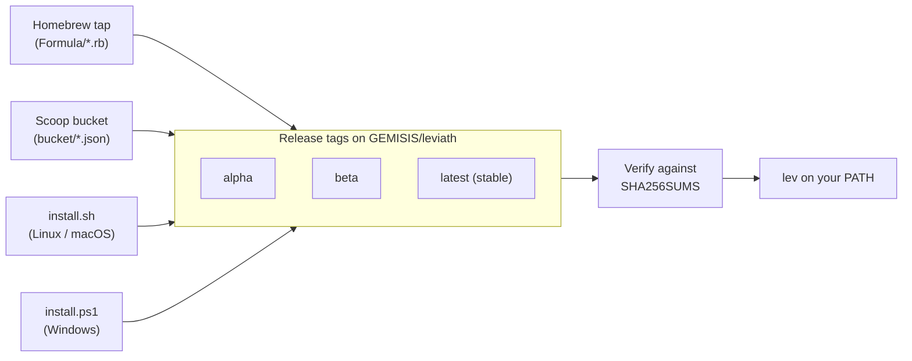

<p align="center">
  <h1 align="center">Leviath</h1>
  <p align="center">
    <strong>A structured agent runtime for LLMs</strong>
  </p>
</p>

<div align="center">

| Linux | macOS | Windows | Coverage |
| :-: | :-: | :-: | :-: |
| [](https://github.com/GEMISIS/leviath/actions/workflows/ci.yml) | [](https://github.com/GEMISIS/leviath/actions/workflows/ci.yml) | [](https://github.com/GEMISIS/leviath/actions/workflows/ci.yml) | [](https://github.com/GEMISIS/leviath/actions/workflows/ci.yml) |

</div>

<p align="center">
  <a href="LICENSE"></a>
  <a href="https://leviath.dev"></a>
</p>

---

Most agent tools give LLMs a flat message array and hope for the best. Leviath gives them structure — structured memory, multi-stage workflows, and an ECS engine — so agents stay coherent on long tasks, use the right model for each phase, and don't melt your machine when you run a dozen at once.

Pick a pre-built agent or create your own. Run it. Watch it actually remember what it read 50 tool calls ago.

This repo is the **distribution channel**: the Homebrew tap, the Scoop bucket, and the install scripts. The runtime itself lives in [GEMISIS/leviath](https://github.com/GEMISIS/leviath). No account or token is needed to install — everything is public.

## Release Channels

Leviath has three release channels, each a rolling release tag on the main repo:

| Channel | Schedule | Stability | Install command |
|---------|----------|-----------|-----------------|
| **Alpha** | Nightly | ⚠️ Bleeding edge | `brew install leviath-alpha` |
| **Beta** | Weekly (Monday) | 🟡 Tested | `brew install leviath-beta` |
| **Stable** | Weekly (Thursday, approved) | ✅ Production | `brew install leviath` |

Every install path resolves a channel to its release tag and verifies the download against the `SHA256SUMS` published in the same release before anything is unpacked:



## Installation

### macOS / Linux (Homebrew)

```bash
# Add the tap (one time)
brew tap gemisis/leviath https://github.com/GEMISIS/leviath-dist.git

# Homebrew 6 requires explicitly trusting third-party taps (one time)
brew trust gemisis/leviath

# Install your channel of choice
brew install leviath         # stable - or: leviath-beta, leviath-alpha
```

To update:

```bash
brew update && brew upgrade leviath
```

> **Note:** Only one channel can be installed at a time. Switch channels with `brew uninstall leviath && brew install leviath-beta`.

### Linux (install script)

```bash
curl -fsSL https://raw.githubusercontent.com/GEMISIS/leviath-dist/main/install.sh | bash -s -- --channel stable
# Channels: alpha (default when omitted), beta, stable
```

#### glibc or musl

Linux ships two builds per architecture, and the script picks for you.

The default archives link the release runner's C library and need **glibc 2.38 or newer** - Ubuntu
24.04 and up. On anything older they fail at exec with `version 'GLIBC_2.38' not found` and never
reach a line of Leviath, which is a confusing way to find out. So the script reads `ldd --version`
first and installs the statically linked **musl** archive instead when the host's glibc is too old
or is musl to begin with. Containers and older CI images get a binary that just runs.

Force either one:

```bash
... | bash -s -- --libc musl   # always static
... | bash -s -- --libc gnu    # always dynamic
```

Every uncertain reading resolves to musl, because the two are not symmetric: a static binary runs
anywhere the dynamic one would have, and the reverse is false. The one thing musl costs is name
resolution through musl's own resolver rather than the system NSS stack, which matters only on
hosts wired to LDAP or mDNS for hostnames - and those have a current glibc, so they never take
this branch.

Homebrew on Linux keeps using the glibc builds. Homebrew has its own minimum glibc well above
this one, so a host that can run `brew` can run them.

**Manual install:**

1. Download the latest release from [GitHub Releases](https://github.com/GEMISIS/leviath/releases)
2. Extract and move to your PATH:

```bash
tar xzf leviath-linux-x64.tar.gz        # or leviath-linux-x64-musl.tar.gz
sudo mv lev /usr/local/bin/
```

### Windows

**Scoop** (recommended):

```powershell
scoop bucket add leviath https://github.com/GEMISIS/leviath-dist.git
scoop install leviath        # stable - or: leviath-beta, leviath-alpha
```

**Install script:**

```powershell
irm https://raw.githubusercontent.com/GEMISIS/leviath-dist/main/install.ps1 | iex
```

This installs `lev.exe` to `%LOCALAPPDATA%\Leviath\bin` and adds it to your
user `PATH`. Re-run the same command to update. To pick a channel, download
the script and run `.\install.ps1 -Channel beta` (or `stable`).

**Manual install:**

1. Download `leviath-windows-x64.zip` from [GitHub Releases](https://github.com/GEMISIS/leviath/releases)
2. Extract `lev.exe`
3. Add the folder containing `lev.exe` to your `PATH`

### Build from Source (any platform)

Requires [Rust](https://rustup.rs/) (stable toolchain):

```bash
cargo install --git https://github.com/GEMISIS/leviath.git --bin lev
```

## Verifying a download

The Homebrew formulae, the Scoop manifests, and both install scripts verify every
download against the release's `SHA256SUMS` automatically and refuse to install on
any mismatch. Releases are additionally attested with GitHub build provenance,
which you can check by hand — it is the stronger guarantee, signed by the build
workflow's identity rather than published beside the asset:

```bash
gh attestation verify leviath-linux-x64.tar.gz --repo GEMISIS/leviath
```

## Quick Start

### 1. Configure a Provider

You need at least one LLM provider. Run the interactive setup:

```bash
lev setup
```

This walks you through adding API keys for any supported provider. You can also pass keys directly:

```bash
lev setup --non-interactive --anthropic-key sk-ant-...
```

**Supported providers:** [Anthropic](https://console.anthropic.com/) · [OpenAI](https://platform.openai.com/) · [Google (Gemini)](https://aistudio.google.com/) · [OpenRouter](https://openrouter.ai/) · [Ollama](https://ollama.com) (local, free)

### 2. Run an Agent

```bash
# Coding
lev run coder --task "Build a CLI that converts CSV to JSON"

# Research
lev run deep-researcher --task "Survey the current state of solid-state battery technology"

# Full software engineering workflow
lev run software-engineer --task "Add input validation to the user registration endpoint"
```

### 3. Watch It Work

Open the TUI dashboard:

```bash
lev dash
```

### 4. Create Your Own Agent

```bash
lev create my-agent
cd my-agent
lev run . --task "Your task here"
```

This scaffolds an `agent.leviath` config you can customize — models per stage, context regions, tools, interaction points.

## Pre-built Agents

Nine agents ship out of the box:

| Agent | Stages | Best For |
|-------|--------|----------|
| **software-engineer** | plan ⇄ implement ⇄ review | Full coding workflow with graph transitions |
| **coder** | analyze → implement ⇄ review | Focused implementation with review loop |
| **reviewer** | scan → deep_review → report | Code review and audit |
| **deep-researcher** | gather ⇄ analyze → synthesize | Thorough single-topic investigation |
| **wide-researcher** | survey ⇄ compare → summarize | Broad multi-topic landscape survey |
| **researcher** | gather ⇄ analyze → summarize | General-purpose research |
| **log-analyzer** | ingest → analyze ⇄ script → report | Log file analysis |
| **daily-briefer** | collect → prioritize → brief | Morning summaries |
| **writing-assistant** | research → outline → draft ⇄ edit | Blog posts, reports, docs |

## CLI Reference

| Command | Description |
|---------|-------------|
| `lev run [path] --task "..."` | Run an agent |
| `lev dash` | TUI dashboard |
| `lev serve` | REST + WebSocket API server |
| `lev create <name>` | Create agent project |
| `lev validate [path]` | Validate agent blueprint |
| `lev pack` / `lev add` / `lev remove` | Package management |
| `lev list` | List available agents |
| `lev test` | Run agent tests |
| `lev setup` / `lev models` | Provider configuration |

## Requirements

- An API key from a supported provider — or run Ollama locally (free, no key)
- macOS, Linux, or Windows
- No runtime dependencies — single binary, no Node/Python/Docker

## Troubleshooting

**`lev: command not found`** — Make sure the binary is on your PATH:
- macOS: Homebrew handles this automatically
- Linux: The install script puts it in `/usr/local/bin`. If you installed manually, ensure the binary location is in your `$PATH`
- Windows: Add the folder containing `lev.exe` to your system PATH ([guide](https://www.architectryan.com/2018/03/17/add-to-the-path-on-windows-10/))

**Auth errors during install** — No token is needed; everything is public. A 401/403
usually means leftovers from the private alpha: remove any
`url."https://…@github.com/GEMISIS/".insteadOf` rewrite from `~/.gitconfig` and
unset stale `GITHUB_TOKEN` / `HOMEBREW_GITHUB_API_TOKEN` exports — an expired token
*fails* requests that would succeed anonymously.

**Provider connection errors** — Run `lev setup` to verify your API key is configured correctly. For Ollama, make sure the server is running (`ollama serve`).

**Permission denied (Linux)** — Make sure the binary is executable: `chmod +x /usr/local/bin/lev`

## Links

- 📖 [Documentation](https://leviath.dev/docs)
- 🐛 [Report an Issue](https://github.com/GEMISIS/leviath/issues)
- 🔒 [Security Policy](SECURITY.md)
- 🤝 [Contributing](CONTRIBUTING.md)
- 📜 [License (MIT)](LICENSE)
